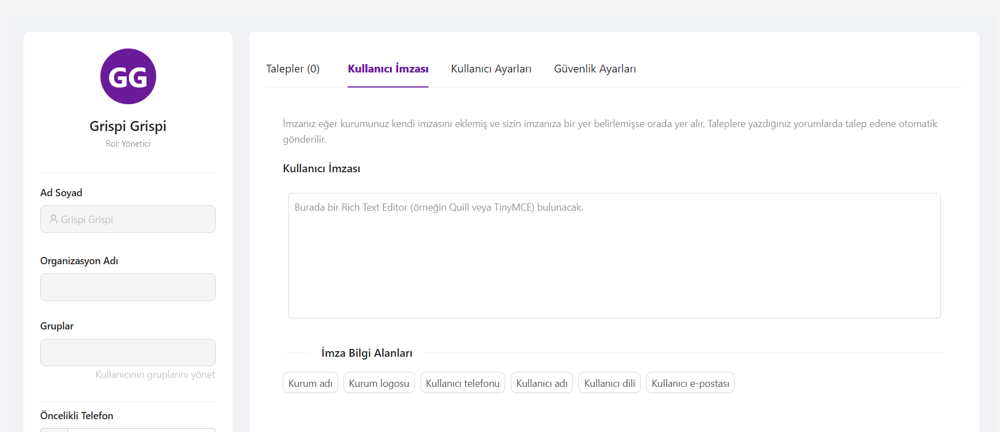

# Grispi Müşteri Portalı

Grispi Müşteri Portalı, müşteri destek süreçlerini dijitalleştirmek ve kolaylaştırmak amacıyla geliştirilmiş **full-stack web uygulamasıdır**. Bu portal, müşterilerin destek talepleri oluşturmasına, mevcut taleplerini takip etmesine, profil bilgilerini yönetmesine ve destek ekibiyle iletişim kurmasına olanak sağlar.

---

## Kullanılan Teknolojiler

### Frontend
- **React 19** 
- **Ant Design 5**  
- **React Router 7**   
- **Axios** -
- **Vite**  
- **Day.js**   

### Backend
- **Node.js 18+** 
- **Express 4**   
- **MongoDB 6+** 
- **Mongoose 7** 
- **JWT**   
- **bcryptjs**  
- **Multer** 
- **Express-Async-Handler**  
- **CORS** 

### Geliştirme Araçları
- **ESLint** - Kod standardizasyonu ve linting  
- **Nodemon** - Geliştirme sunucusu  
- **dotenv** - Ortam değişkenleri yönetimi  

---

## Özellikler

### 1. Authentication Sistemi
- **JWT tabanlı güvenli giriş**  
- **Kayıt ol** ve **Giriş yap** sayfaları  
- **Protected Routes** ile yetkisiz erişim koruması  
- **Otomatik logout** - Token süresi dolduğunda çıkış  
- **Password hashing** ile güvenli şifre saklama  

### 2. Talep Yönetimi
- **Talep Oluşturma** - Çok adımlı form ile kolay talep oluşturma  
- **Talep Listesi** - Filtreleme, arama ve sıralama  
- **Talep Detayı** - Mesajlaşma ve durum takibi  
- **Dosya Ekleme** - Talep ile birlikte ek dosya yükleme  
- **Otomatik Numaralandırma** - T1001, T1002… formatında  

### 3. Kullanıcı Yönetimi
- **Profil Güncelleme** - Kişisel bilgileri düzenleme  
- **Şifre Değiştirme** - Güvenli şifre güncelleme  
- **Kullanıcı Bilgileri** - Ad, soyad, email, telefon, adres  

### 4. Modern UI/UX
- **Responsive Design** - Mobil ve desktop uyumlu  
- **Ant Design** - Modern ve tutarlı arayüz  
- **Gradient Backgrounds** - Görsel çekicilik  
- **Loading States** - Kullanıcı deneyimi için animasyon  
- **Error Handling** - Kullanıcı dostu hata mesajları  

---

## Veri Modelleri

### User Model
{
  "firstName": "String",
  "lastName": "String",
  "email": "String",
  "phone": "String",
  "address": "String",
  "password": "String",
  "role": "String",
  "createdAt": "Date",
  "updatedAt": "Date"
}

### Ticket Model
{
  "kullaniciId": "ObjectId",
  "kullaniciAdi": "String",
  "kullaniciEmail": "String",
  "talepNumarasi": "String",
  "baslik": "String",
  "aciklama": "String",
  "kategori": "String",
  "oncelik": "String",
  "durum": "String",
  "mesajlar": [
    {
      "gonderen": "String",
      "mesaj": "String",
      "gondermeTarihi": "Date"
    }
  ],
  "sonGuncelleme": "Date",
  "createdAt": "Date",
  "updatedAt": "Date"
}

---

## API Endpoints

### Authentication
POST /api/users/register      
POST /api/users/login  

### User Management
GET  /api/users/profile       
PUT  /api/users/profile  
PUT  /api/users/change-password   

### Ticket Management
GET  /api/ticket     
GET  /api/ticket/:id  
POST /api/ticket     
POST /api/ticket/:id/message 

---

## Kurulum ve Çalıştırma

### Gereksinimler
- Node.js 18+
- MongoDB 6+
- npm veya yarn  

### Backend Kurulumu
cd backend  
npm install  
npm run dev  

### Frontend Kurulumu
cd frontend  
npm install  
npm run dev  

### Erişim
- **Frontend:** http://localhost:5173  
- **Backend API:** http://localhost:5000  

---

## Güvenlik Özellikleri
- JWT Authentication  
- Password Hashing  
- Input Validation  
- CORS Protection  
- Error Handling  

---

## Görseller
## Giriş

## Menü

## Talepler

## Ara

## Talep Ara

## Talep Detay

## Talepler Profil

## Yeni Talep

## Kullanıcı Ekle

## Organizasyon Ekle

## Kullanıcı İmzası

## Ayarlar

## Güvenlik

